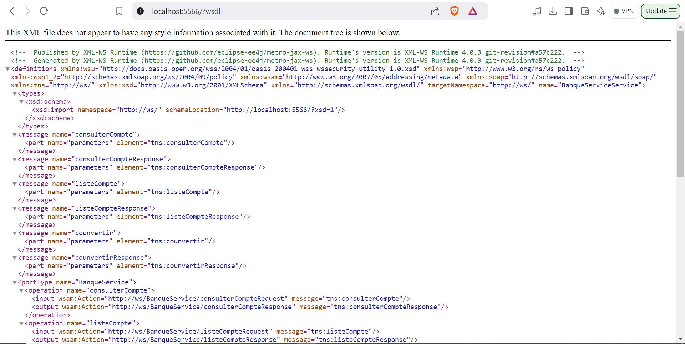
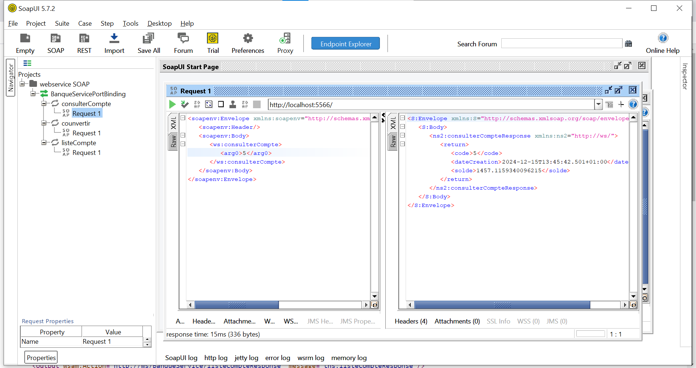
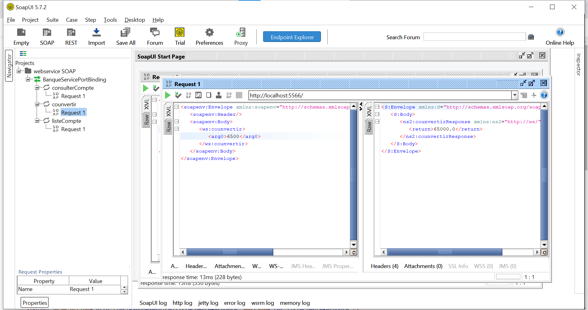
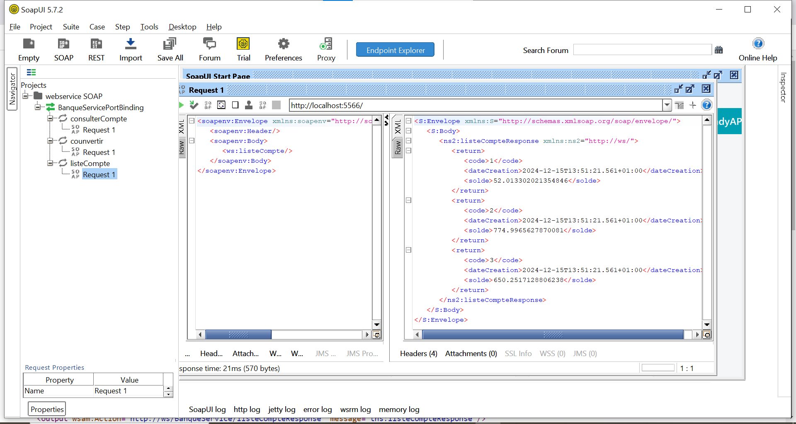
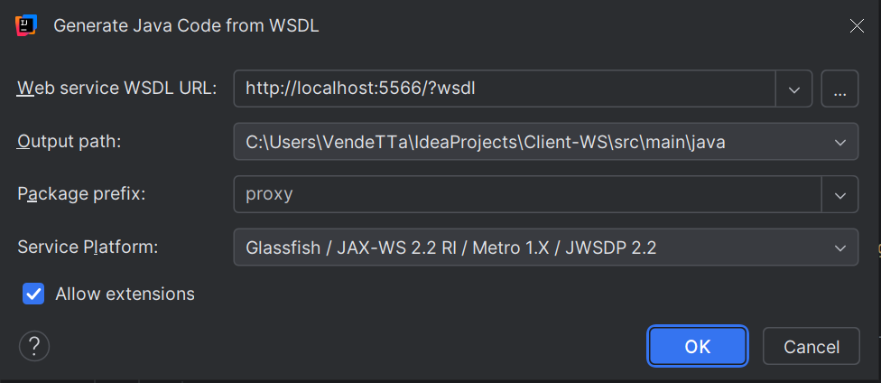
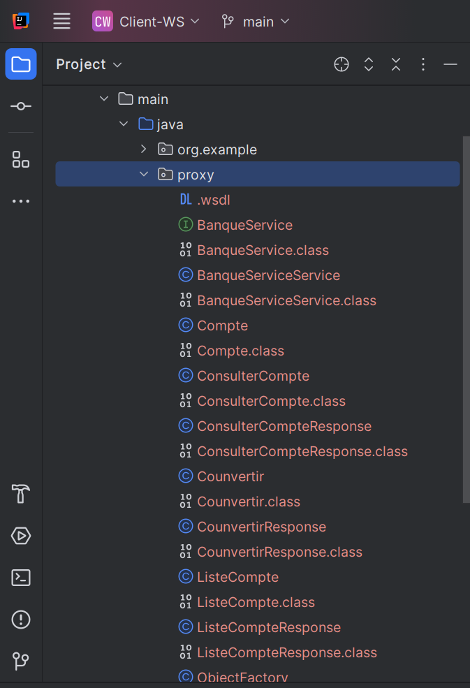
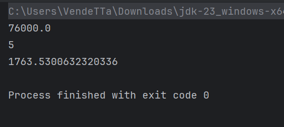
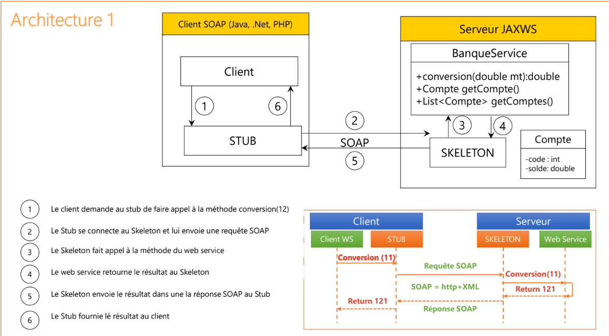

# Web-Service
Web Service with SOAP

<h1> Application accessible via http://localhost:5566/</h1>

<h1>Description WSDL</h1>

<h1>Requete Consulter Compte</h1>

<h1>Requete convertir </h1>

<h1>Requete lister Compte</h1>

<h1>Generation du proxy a partir du WSDL</h1>

<h1> Structure du proxy generer</h1>

<h1>Teste du web service </h1>

<h1>Architecture du WebService</h1>

